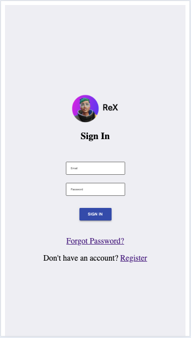
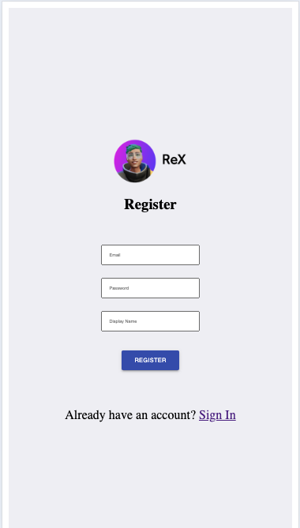
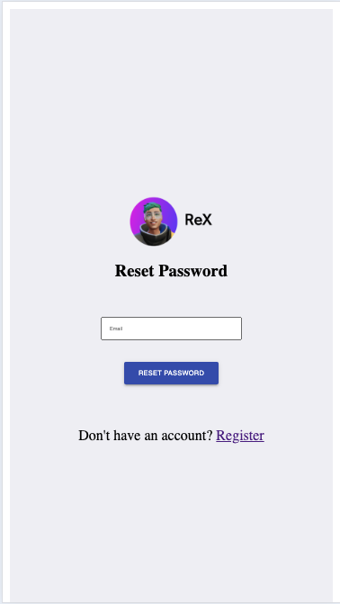
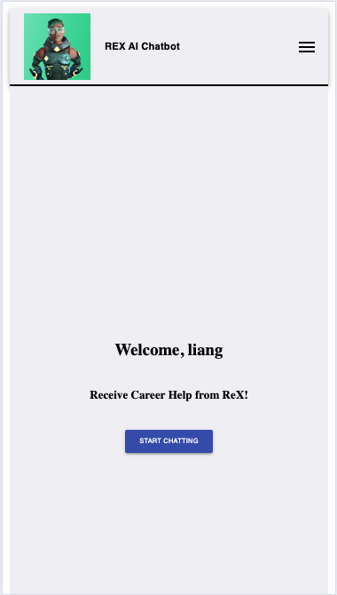
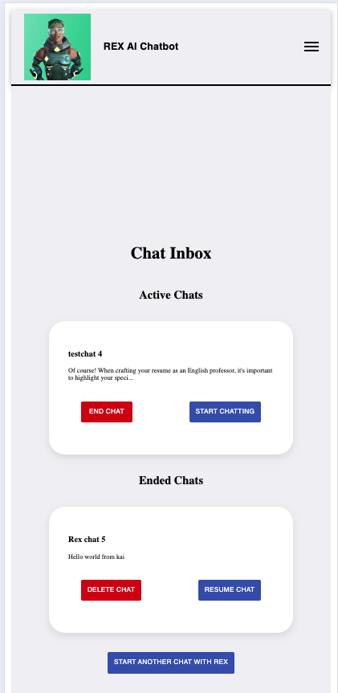
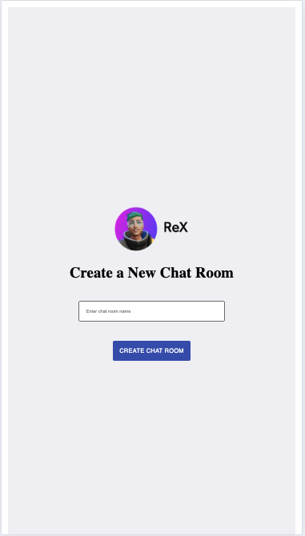
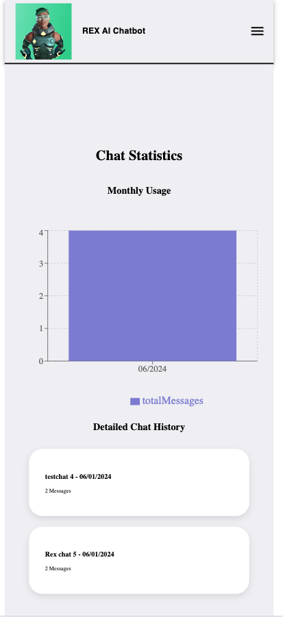

# CosmoChat-UI

## Description
In today's digital age, seamless interaction remains a cornerstone of user engagement and satisfaction. CosmoChat is an example of a state-of-the-art chat application designed to revolutionize digital communication. It leverages the power of OpenAI’s GPT-3.5 to provide a dynamic, engaging, and intuitive chat interface.

## Features
### Dynamic Chat Interface
At the core of CosmoChat is a dynamic chat interface where users can interact with ReX, our advanced AI chatbot. ReX is powered by the cutting-edge capabilities of OpenAI’s GPT-3.5, enabling it to understand and respond to user queries in a conversational manner. This feature aims to facilitate seamless and meaningful conversations, thereby enhancing user engagement and satisfaction.

### Activity Dashboard
In addition to the chat interface, CosmoChat features an Activity Dashboard. This dashboard provides real-time monitoring of user interactions and achievements. It allows users to track their engagement and fosters continuous interaction by highlighting their progress and milestones.

### Intuitive and Secure Authentication
CosmoChat prioritizes user security and privacy. It features an intuitive and secure authentication process that ensures each user will be able to access there own chat threads without any issues. It uses email/password as the main source of authentication and allows you to reset passwords when needed.

## Get Started

### Prerequsites
- Node.js and npm
- React
- Material UI
- Open AI
- Firebase
- 
### Installing

1. Make sure that the QuantumBot Core project is running first before you move on to the next steps here
2. Once your done, Open up a new terminal and begin with cloning the repository: `git clone <repository-url>`
3. Navigate into the root project directory: `cd cosmochat-ui`
4. Go to the OpenAI website, create an account, and get access to a project API Key (you will also need to add credit into your account to be able to use OpenAI).
5. Go to the .env file and put in your API key there as so by replacing the 'XXXXXX' with your OpenAI key;
6. Type in `npm install` to install all of the dependencies within this project
7. Then run `npm start`, and then your done!

## Screenshot of Pages

### Initial Landing Page

### Login Page

### Register Page

### Reset Password Page

### Landing Page After Login

### Chat Inbox Page

### Chat Creation Page

### Chat Thread Page

### Activity Logs Page
